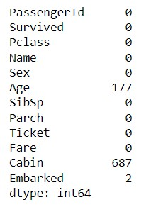
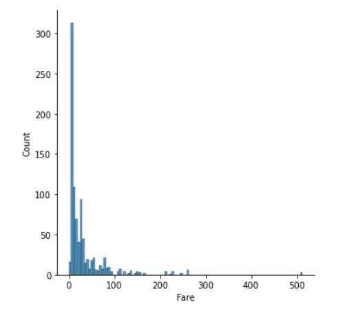

# Ex-03EDA

## AIM
To perform EDA on the given data set. 

# Explanation
The primary aim with exploratory analysis is to examine the data for distribution, outliers and 
anomalies to direct specific testing of your hypothesis.
 

# ALGORITHM
### STEP 1
Read the given Data

### STEP 2
Get the information about the data

### STEP 3
Remove the null values from the data

### STEP 4
Save the Clean data to the file

# CODE
# DATA ANALYSIS STEPS
import numpy as np

import pandas as pd

import seaborn as sns

df=pd.read_csv("titanic_dataset.csv")

df.info()

df.head()

df.isnull().sum()

df.drop("Cabin",axis=1,inplace=True)

df.isnull().sum()

df['Age']=df['Age'].fillna(df['Age'].median())

df['Embarked']=df['Embarked'].fillna(df['Embarked'].mode()[0])

df.isnull().sum()

df.boxplot()

df["Embarked"].value_counts()

df["Pclass"].value_counts()

df["Survived"].value_counts()

pd.crosstab(df["Pclass"],df["Age"])

df.corr()

 sns.countplot(x="Survived",data=df)

sns.countplot(x="Pclass",data=df)

sns.countplot(x="Sex",data=df)

sns.displot(df["Age"])

sns.displot(df["Fare"])

sns.countplot(x="Pclass",hue="Survived",data=df)

sns.countplot(x="Age",hue="Sex",data=df)

sns.countplot(x="Age",hue="Survived",data=df)

sns.displot(df[df['Survived']==0]["Age"])

sns.displot(df[df['Survived']==1]["Age"])

sns.heatmap(df.corr(),annot=True)

# OUTPUT
Finally, the given data's were analyzed successfully.

